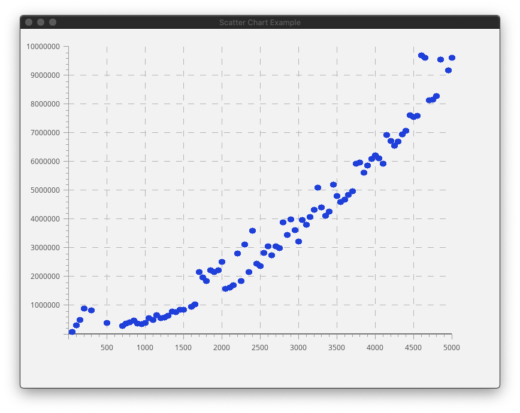

# Algorithms
General CS Algorithms, implemented in C

------------------

## Algorithm tree 

- `ui`
	- `SDL_util.c`
		- Bresenham line Algorithm (for dotted lines)
		- Bresenham (midpoint) circle algorithm (for filled and non-filled circles)
	- `plotter.c`
		- Graph scale determining algorithm
- `util`
	- `ds.c`
		- ArrayList implementation
	- `intgen.c`
		- PriorityQueue implementation for storing sorted numbers
		- Inversion insertion algorithm - inserts `n` inversions into a sorted 
		  array. An inversion is when `i<j` and `A[i] > A[j]`
